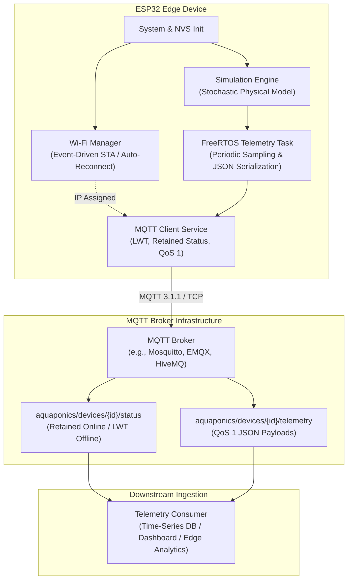

# Aquaponics Edge Simulator

> ESP32-based MQTT telemetry simulator for aquaponics edge and IoT experiments.

[](https://github.com/led-21/AquaponicsEdgeSimulator/actions/workflows/ci.yml)
[](https://docs.espressif.com/projects/esp-idf/)
[](https://www.freertos.org/)
[](LICENSE)

---

## Overview

**Aquaponics Edge Simulator** is an embedded C IoT firmware application engineered on Espressif's ESP-IDF and FreeRTOS. It models and publishes high-fidelity aquaponics water telemetry to an MQTT broker.

Rather than emitting static or purely random mock data, this firmware executes a bounded stochastic physical model simulating the interdependent biological dynamics of recirculating aquaponic ecosystems (pH balance, water temperature, electrical conductivity, and dissolved oxygen). 

Designed as an edge-computing portfolio showcase, the architecture demonstrates production-grade embedded patterns:
* **Separation of Concerns**: Decoupled network, messaging, telemetry serialization, and simulation modules.
* **Resilient Communication**: Non-blocking Wi-Fi lifecycle management, automatic reconnect, MQTT QoS 1 delivery, and broker-enforced Last Will and Testament (LWT).
* **Deterministic Simulation**: Configurable PRNG seeding and scenario injection (e.g., acidification drift, thermal spikes, hypoxia).
* **Hardware-Independent Testability**: Pure C simulation and serialization engines tested on host machines via CMake and CTest without physical target hardware.

---

## Architecture

The firmware runs as a set of FreeRTOS tasks coordinating sensor simulation, network connectivity, and telemetry ingestion:



---

## Features

* **Embedded C & FreeRTOS**: Multi-tasking design with deterministic task delays, thread-safe event groups, and bounded memory footprints.
* **Realistic Aquaponics Modeling**: Bounded random-walk engine simulating real water chemistry setpoints and biological drift.
* **Resilient MQTT Lifecycle**:
  * Persistent connection state machine with automatic exponential reconnect.
  * **Last Will and Testament (LWT)**: Retained offline message on unexpected link loss.
  * Retained birth certificate (`online`) published upon handshake.
* **Zero Hardcoded Secrets**: Fully configurable via Kconfig (`idf.py menuconfig`), supporting segregation of Wi-Fi credentials and broker endpoints.
* **Standard JSON Schemas**: Self-contained, portable telemetry payloads free of proprietary or legacy vendor identifiers.
* **Host Unit Testing**: 100% test coverage for physics bounds, mode transitions, topic builders, and JSON serialization executable on Linux, macOS, and Windows.
* **Containerized & CI-Ready**: Fully automated GitHub Actions pipeline with pre-configured Dev Container support.

---

## Telemetry Model

Readings are serialized as compact JSON payloads:

```json
{
  "deviceId": "esp32-sim-01",
  "timestamp": "2026-01-01T12:00:00Z",
  "readings": {
    "ph": 6.82,
    "temperature": 23.54,
    "ec": 1.51,
    "dissolvedOxygen": 7.18
  }
}
```

### Parameter Specifications

| Parameter | Unit | Nominal Aquaponic Range | Physical Clamping Limits | Biological Impact |
| :--- | :--- | :--- | :--- | :--- |
| **pH** | pH scale | 6.5 – 7.2 | 0.0 – 14.0 | Nitrifying bacteria efficiency & nutrient bioavailability |
| **Temperature** | °C | 20.0 – 26.0 | 0.0 – 50.0 | Fish metabolism & oxygen dissolution capacity |
| **Electrical Conductivity (EC)** | mS/cm | 1.2 – 2.0 | 0.0 – 5.0 | Total dissolved salts and plant nutrient concentration |
| **Dissolved Oxygen (DO)** | mg/L | 6.0 – 8.5 | 0.0 – 20.0 | Fish respiration (hypoxia occurs < 3.0 mg/L) |

---

## MQTT Topics

The device follows a structured topic taxonomy:

| Topic Pattern | Direction | QoS | Retained | Purpose |
| :--- | :---: | :---: | :---: | :--- |
| `aquaponics/devices/{deviceId}/telemetry` | Publish | 1 | No | Real-time periodic water sensor readings |
| `aquaponics/devices/{deviceId}/status` | Publish | 1 | Yes | Device presence (`online` on connect, `offline` via LWT) |

### Device Status Payload Example

```json
{
  "deviceId": "esp32-sim-01",
  "status": "offline",
  "reason": "unexpected_disconnect"
}
```

---

## Simulation Modes

Operational scenarios can be selected at compile time via `menuconfig` or switched dynamically:

* **`NORMAL`**: Stable equilibrium around setpoints (pH 6.8, 23.5 °C, 1.5 mS/cm, 7.2 mg/L DO) with stochastic noise and slight mean reversion.
* **`PH_DRIFT`**: Simulates acidification caused by continuous nitrifying conversion of ammonium into nitrate without adequate buffer additions.
* **`HIGH_TEMPERATURE`**: Simulates cooling system failure or seasonal thermal stress; water temperature climbs, depressing dissolved oxygen saturation.
* **`LOW_DISSOLVED_OXYGEN`**: Simulates aerator or air pump failure, driving DO into dangerous hypoxia zones.

Deterministic pseudo-random sequences can be locked with a configurable non-zero seed (`CONFIG_SIMULATOR_SEED`).

---

## Project Structure

```
AquaponicsEdgeSimulator/
├── .devcontainer/               # Reproducible ESP-IDF dev environment (Docker)
├── .github/
│   └── workflows/
│       └── ci.yml               # Automated GitHub Actions (Tests + Firmware Build)
├── deploy/                      # Local telemetry ingestion & visualization stack
│   ├── grafana/
│   │   ├── dashboards/          # Pre-built aquaponics telemetry dashboard
│   │   └── provisioning/        # Automatic datasource and dashboard provisioning
│   ├── mosquitto/               # Eclipse Mosquitto MQTT broker configuration
│   └── telegraf/                # MQTT to InfluxDB metrics consumer configuration
├── main/
│   ├── include/
│   │   ├── mqtt_client_service.h# MQTT client lifecycle & topic manager
│   │   ├── simulator.h          # Aquaponics physical engine definitions
│   │   ├── telemetry.h          # JSON schema serialization & topic builders
│   │   └── wifi_manager.h       # Event-driven Wi-Fi station controller
│   ├── app_main.c               # Entrypoint & FreeRTOS telemetry task
│   ├── CMakeLists.txt           # Main component build rules
│   ├── idf_component.yml        # Espressif Component Manager manifest
│   ├── Kconfig.projbuild        # Configuration menu definitions
│   ├── mqtt_client_service.c    # MQTT service implementation
│   ├── simulator.c              # Bounded stochastic physical simulation
│   ├── telemetry.c              # Telemetry formatting & JSON builder
│   └── wifi_manager.c           # Wi-Fi event handler and reconnection state
├── scripts/
│   └── mock_publisher.py       # Standalone Python simulator for hardware-free demos
├── tests/
│   ├── CMakeLists.txt           # Host test build configuration
│   └── test_aquaponics_simulator.c # Host unit test suite (CTest / GCC)
├── CMakeLists.txt               # Root project CMake file
├── docker-compose.yml           # One-click Mosquitto + InfluxDB + Telegraf + Grafana
├── LICENSE                      # Apache-2.0 open-source license
├── NOTICE                       # Attribution and third-party notices
├── README.md                    # Project documentation
├── sdkconfig.defaults           # Portable reproducible defaults
└── .gitignore                   # Rigorous ignore list (no secrets or artifacts)
```

---

## Configuration

The simulator does not require editing C sources to change credentials or endpoints. All settings can be adjusted through the ESP-IDF Kconfig menu:

```bash
idf.py menuconfig
```

Navigate to **Aquaponics Edge Simulator Configuration**:
* **Wi-Fi Configuration**: Set Target SSID and Password.
* **MQTT Configuration**: Set Broker URI (e.g., `mqtt://192.168.1.100:1883`), Username, and Password.
* **Telemetry & Simulation Settings**: Configure Device ID (`esp32-sim-01`), Telemetry Interval, Simulation Scenario, and PRNG Seed.

---

## Building

### Option 1: Native ESP-IDF Environment

Ensure ESP-IDF (v5.3 or newer) is sourced in your shell:

```bash
# Set target architecture
idf.py set-target esp32

# Build application
idf.py build
```

### Option 2: VS Code Dev Container

Open the repository in VS Code with the **Remote - Containers** extension. The container will automatically load the full ESP-IDF toolchain. Open the integrated terminal and run:

```bash
idf.py build
```

---

## Flashing & Monitoring

Connect your ESP32 board via USB, identify the serial port, and flash:

```bash
# Replace PORT with your device path (e.g., /dev/ttyUSB0 on Linux or COM3 on Windows)
idf.py -p PORT flash monitor
```

To exit the serial monitor, press `Ctrl + ]`.

---

## Running

Sample serial monitor output on boot:

```text
I (312) aquaponics_main: ==================================================
I (312) aquaponics_main:   Aquaponics Edge Simulator (ESP32 / ESP-IDF)     
I (322) aquaponics_main: ==================================================
I (332) aquaponics_main: Silicon: esp32 (2 CPU cores, Wi-Fi/BT/BLE), Flash: 4 MB
I (342) aquaponics_main: Simulator initialized (Mode: NORMAL, Seed: 42)
I (352) wifi_manager: Wi-Fi initialization complete. Target SSID: HOME_IOT
I (362) aquaponics_main: Waiting for network connectivity...
I (1850) wifi_manager: Connected successfully. Assigned IP: 192.168.1.142
I (1860) aquaponics_main: Network ready. Initializing MQTT client service...
I (1870) mqtt_service: MQTT client service started. Broker: mqtt://192.168.1.100:1883
I (1880) aquaponics_main: Telemetry task started. Target interval: 10 s, Device: esp32-sim-01
I (2120) mqtt_service: Connected to MQTT broker: mqtt://192.168.1.100:1883
I (2130) aquaponics_main: Telemetry [NORMAL]: pH=6.81, Temp=23.52 C, EC=1.50 mS/cm, DO=7.19 mg/L
```

---

## End-to-End Local Demonstration

You can launch the full ingestion and telemetry visualization infrastructure (**Mosquitto MQTT Broker + InfluxDB + Telegraf + Grafana**) with a single command:

```bash
docker compose up -d
```

### Accessing the Dashboard

Open your browser at **`http://localhost:3001`**:
* **Datasource**: Pre-configured InfluxDB (`aquaponics` database).
* **Dashboard**: Pre-provisioned **"Aquaponics Edge Telemetry"** dashboard with live gauges and historical timeseries charts for water pH, temperature, EC, and dissolved oxygen.

### Hardware-Free Testing (Mock Edge Publisher)

If you do not have a physical ESP32 connected right now, you can stream simulated edge data directly into the broker using either:

```bash
# Option 1: Start the containerized mock edge publisher
docker compose --profile mock up -d

# Option 2: Run the standalone Python script locally
pip install paho-mqtt
python scripts/mock_publisher.py --mode NORMAL --interval 3
```

To test failure scenarios in Grafana (e.g. thermal spike or hypoxia):

```bash
python scripts/mock_publisher.py --mode HIGH_TEMPERATURE
# or
python scripts/mock_publisher.py --mode LOW_DISSOLVED_OXYGEN
```

---

## Testing

Host unit tests validate the simulation engine and JSON serialization without needing physical hardware:

```bash
cd tests
mkdir -p build && cd build
cmake ..
cmake --build .
ctest --output-on-failure
```

### Test Coverage Highlights
* **Initial State Determinism**: Verification of repeatable startup values given a fixed seed.
* **Physical Boundary Clamping**: 1000-step continuous boundary invariance across all operational modes.
* **Scenario Dynamics**: Directional drift verification for pH depletion, temperature increases, and hypoxia.
* **Topic Generation**: Buffer overflow protection and formatting accuracy.
* **JSON Serialization**: Full schema validation, numeric precision, and absence of legacy identifiers.

---

## CI

This repository uses GitHub Actions to enforce code quality on every push and pull request:
* **Host Unit Tests**: Compiles and executes the test harness under Linux with CTest.
* **Firmware Clean Build**: Executes `idf.py build` in Espressif's official Docker container to guarantee compilation integrity.

---

## Security

* **No Hardcoded Credentials**: Wi-Fi passwords, broker credentials, and endpoints are excluded from source files and kept in unversioned local configs (`sdkconfig`).
* **Safe Defaults**: `sdkconfig.defaults` provides generic placeholders (`YOUR_WIFI_SSID`, `192.168.1.100`) allowing immediate compilation without secret exposure.
* **Transport Encryption Ready**: ESP-IDF `esp-tls` and MQTT SSL (`mqtts://`, port 8883) can be enabled directly through Kconfig.
* **Sanitized History**: The repository history contains zero leaks, private IP addresses, or personal credentials.

---

## Roadmap

* [ ] **TLS / mTLS Support**: Native X.509 client certificate authentication for AWS IoT Core and Azure IoT Hub.
* [ ] **Downlink Command Handling**: Subscribe to `aquaponics/devices/{deviceId}/commands` to allow remote mode switching (e.g., triggering drift scenarios via MQTT).
* [ ] **Over-The-Air (OTA) Updates**: Secure HTTPS firmware upgrade task.
* [ ] **Edge Anomaly Detection**: Lightweight on-chip rule-engine triggering immediate alert publications when thresholds are breached.

---

## License

This project is licensed under the [Apache License 2.0](LICENSE).  
Portions derived from Espressif Systems examples are licensed under Apache License 2.0 / CC0-1.0 as documented in [NOTICE](NOTICE).
